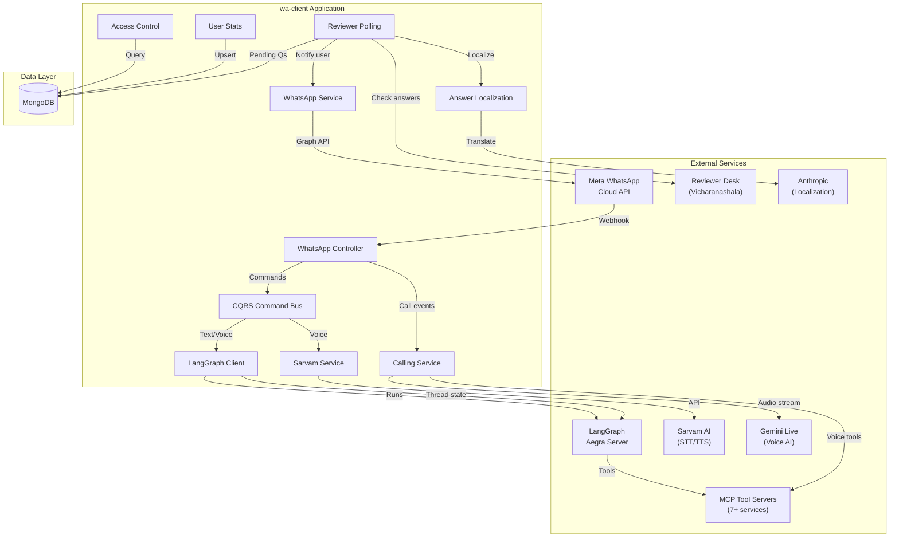
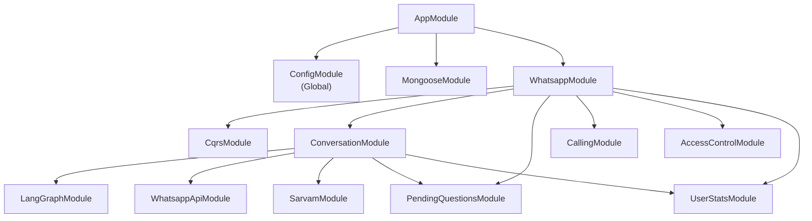
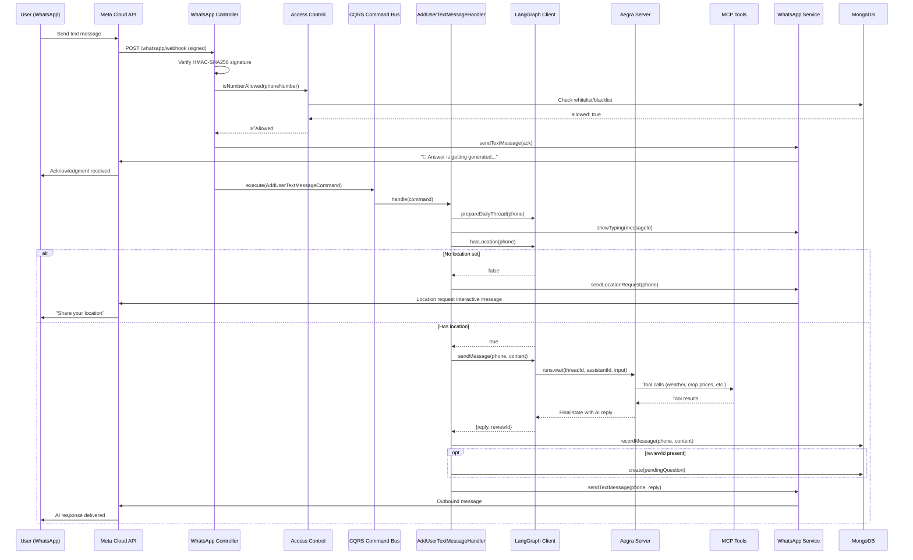
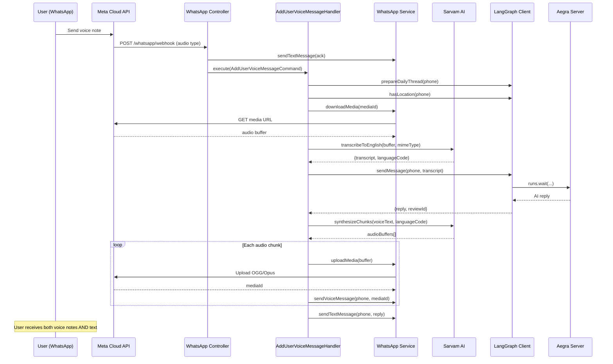
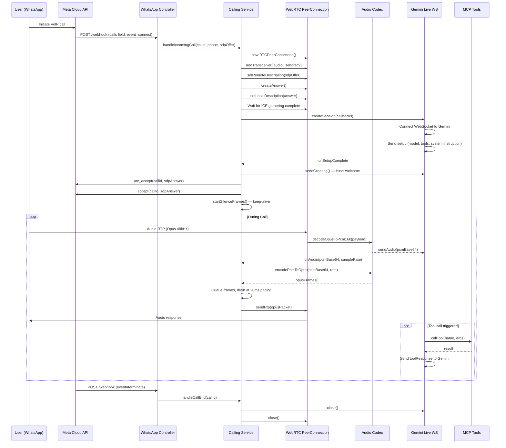
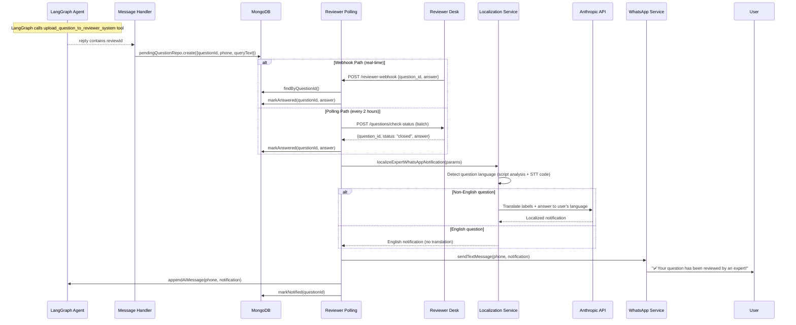
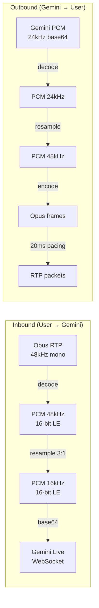

# Architecture Documentation

> System architecture, component interactions, data flows, and design decisions for the AjraSakha WhatsApp AI Assistant.

---

## Table of Contents

- [System Overview](#system-overview)
- [High-Level Architecture](#high-level-architecture)
- [Module Architecture](#module-architecture)
- [Request/Response Flows](#requestresponse-flows)
- [Component Interactions](#component-interactions)
- [Data Flow Diagrams](#data-flow-diagrams)
- [Design Patterns](#design-patterns)
- [Developer Guide](#developer-guide)

---

## System Overview

AjraSakha is a **NestJS monolithic application** structured as a modular monolith. The application serves as the communication bridge between:

1. **Meta WhatsApp Cloud API** — Inbound/outbound messaging
2. **LangGraph/Aegra Server** — AI agent orchestration with tool calling
3. **MCP Tool Servers** — Domain-specific data sources (crop prices, weather, government schemes)
4. **Reviewer System (Vicharanashala Desk)** — Human expert review platform
5. **Sarvam AI** — Indian-language Speech-to-Text and Text-to-Speech
6. **Gemini Live** — Real-time voice conversation via WebSocket



---

## Module Architecture

### Module Dependency Tree



### Module Responsibilities

| Module | Location | Responsibility |
|---|---|---|
| `AppModule` | `src/app.module.ts` | Root module. Registers ConfigModule (global), MongooseModule, WhatsappModule |
| `WhatsappModule` | `src/whatsapp/whatsapp.module.ts` | Registers controller, imports sub-modules, provides WhatsappService |
| `ConversationModule` | `src/whatsapp/conversations/conversation.module.ts` | CQRS command handlers for text, voice, and location messages |
| `LangGraphModule` | `src/whatsapp/conversations/langgraph.module.ts` | LangGraph SDK client for Aegra server communication |
| `CallingModule` | `src/whatsapp/calling/calling.module.ts` | Real-time VoIP: WebRTC, Opus codec, Gemini Live, MCP tools |
| `PendingQuestionsModule` | `src/whatsapp/pending-questions/pending-questions.module.ts` | Expert review pipeline: persistence, polling, webhook, localization |
| `AccessControlModule` | `src/whatsapp/access-control/access-control.module.ts` | Whitelist/blacklist phone number gating |
| `UserStatsModule` | `src/whatsapp/user-stats/user-stats.module.ts` | User engagement tracking and analytics |
| `SarvamModule` | `src/whatsapp/sarvam-api/sarvam.module.ts` | Sarvam AI integration for STT and TTS |
| `WhatsappApiModule` | `src/whatsapp/whatsapp-api/whatsapp-api.module.ts` | Meta Graph API wrapper for outbound messaging |

---

## Request/Response Flows

### Text Message Flow



### Voice Message Flow



### VoIP Call Flow



### Expert Review Pipeline



---

## Component Interactions

### LangGraph Client — Thread Management

The `LangGraphClientService` is the central orchestration layer for AI conversations:

- **Thread ID Strategy**: `{phoneNumber}-{YYYY-MM-DD}` (IST timezone) — one thread per user per day
- **Daily Handover**: At IST midnight boundary, yesterday's thread is summarized (via `summaryAssistantId`), the summary stored in LangGraph `store`, and location state is carried forward
- **Thread Repair**: If a thread has orphaned tool calls (AI message with `tool_calls` but no tool responses), the service injects synthetic tool responses before retrying
- **Thread Reset**: As a last resort, corrupted threads are deleted and recreated (loses history)

### MCP Tool Integration

Two separate MCP integrations exist:

1. **Text Pipeline**: Tools are integrated server-side within the LangGraph/Aegra agent. The wa-client doesn't directly manage text MCP tools — it just forwards messages to the agent.

2. **Voice Pipeline**: The `McpToolsService` discovers and invokes tools directly from the wa-client during Gemini Live calls. It connects to 8 MCP servers on startup:
   - `golden` — Golden dataset queries
   - `pop` — Package of Practices
   - `agmarknet` — Agricultural market prices
   - `enam` — National Agriculture Market
   - `weather` — IMD weather data
   - `faq-videos` — FAQ video references
   - `golden-n` — Extended golden dataset
   - `govt-schemes` — Government agricultural schemes

### Audio Processing Pipeline



The audio codec service uses `@discordjs/opus` for Opus encoding/decoding and linear interpolation for sample rate conversion (48kHz ↔ 16kHz/24kHz). Silence frames are sent during idle periods to keep the WebRTC connection alive.

---

## Design Patterns

### CQRS (Command Query Responsibility Segregation)

All user-initiated actions are dispatched as **commands** through NestJS's `CommandBus`:

| Command | Handler | Trigger |
|---|---|---|
| `AddUserTextMessageCommand` | `AddUserTextMessageHandler` | Incoming text message |
| `AddUserVoiceMessageCommand` | `AddUserVoiceMessageHandler` | Incoming voice note |
| `SetUserLocationCommand` | `SetUserLocationHandler` | Incoming location share |

This separation ensures the controller remains thin — it only handles HTTP concerns (signature verification, access control gating) and delegates business logic to handlers.

### Repository Pattern

Database access is abstracted through **abstract repository classes** with concrete MongoDB implementations:

| Abstract | Concrete | Collection |
|---|---|---|
| `PendingQuestionRepository` | `MongoPendingQuestionRepository` | `pending_questions` |
| `WhatsappUserRepository` | `MongoWhatsappUserRepository` | `whatsapp_users` |

This allows swapping storage backends without changing business logic.

### Fire-and-Forget with Error Boundaries

The controller dispatches commands asynchronously with `.catch()` error handlers:

```typescript
this.commandBus
  .execute(new AddUserTextMessageCommand(...))
  .catch((err) => this.logger.error(`Command failed: ${err.message}`));
```

This ensures the webhook always returns `200 OK` to Meta immediately, while processing happens in the background. If processing fails, errors are logged but don't cause webhook retries.

---

## Developer Guide

### Adding a New Message Type Handler

1. Create a new directory under `src/whatsapp/conversations/application/`
2. Define a **Command** class and a **CommandHandler** class in a single file
3. Register the handler as a provider in `ConversationModule`
4. Add webhook parsing logic in `WhatsappController.receive()`

### Adding a New MCP Server

1. Add the server configuration to `config.yaml` under `mcp.servers.text` and/or `mcp.servers.voice`
2. For voice calls: Add the server URL to `McpToolsService.MCP_SERVERS`
3. For text: The LangGraph agent handles MCP tool integration server-side

### Adding a New API Endpoint

1. Add the route handler method to `WhatsappController`
2. Use `@Headers('x-internal-api-key')` for internal endpoints
3. Call `this.assertInternalApiKey(apiKey)` for authentication
4. Add request/response types inline or in dedicated DTO files

### Coding Standards

- **Module Pattern**: Every feature is a NestJS module with its own folder
- **Service Injection**: Use constructor injection with NestJS DI
- **Error Handling**: Log errors with NestJS `Logger`, never throw uncaught exceptions in async handlers
- **Naming**: PascalCase for classes, camelCase for methods/properties, kebab-case for file names
- **Configuration**: Secrets in `.env`, everything else in `config.yaml`
- **Linting**: ESLint + Prettier (run `npm run lint` and `npm run format`)
