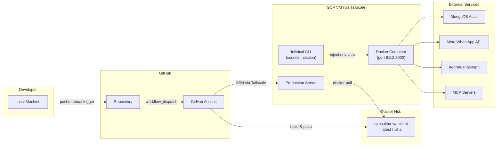
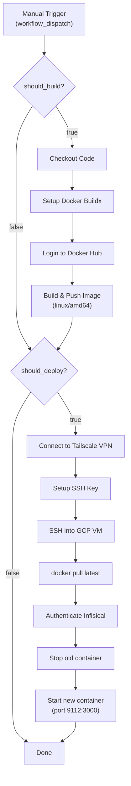

# Deployment Documentation

> CI/CD pipeline, Docker deployment, infrastructure requirements, and rollback strategy for the AjraSakha WhatsApp AI Assistant.

---

## Table of Contents

- [Deployment Architecture](#deployment-architecture)
- [CI/CD Pipeline](#cicd-pipeline)
- [Docker Configuration](#docker-configuration)
- [Infrastructure Requirements](#infrastructure-requirements)
- [Secrets Management](#secrets-management)
- [Manual Deployment](#manual-deployment)
- [Rollback Strategy](#rollback-strategy)
- [Health Monitoring](#health-monitoring)
- [Scaling Considerations](#scaling-considerations)

---

## Deployment Architecture



---

## CI/CD Pipeline

The deployment pipeline is defined in `.github/workflows/dockerhub-build.yml` and is triggered **manually** via `workflow_dispatch`.

### Pipeline Steps



### Workflow Configuration

| Input | Options | Default | Description |
|---|---|---|---|
| `should_build` | `true` / `false` | `true` | Whether to build and push the Docker image |
| `should_deploy` | `true` / `false` | `true` | Whether to deploy to the GCP VM |

### Required GitHub Secrets

| Secret | Purpose |
|---|---|
| `DOCKERHUB_USERNAME` | Docker Hub login |
| `DOCKERHUB_TOKEN` | Docker Hub access token |
| `SSH_PRIVATE_KEY` | ED25519 key for VM SSH access |
| `VM_HOST` | GCP VM hostname/IP |
| `VM_USER` | SSH username on VM |
| `TS_CLIENT_ID` | Tailscale OAuth client ID |
| `TS_CLIENT_SECRET` | Tailscale OAuth client secret |
| `INFISICAL_CLIENT_ID` | Infisical universal auth client ID |
| `INFISICAL_CLIENT_SECRET` | Infisical universal auth client secret |
| `INFISICAL_PROJECT_ID` | Infisical project ID |

### Image Tagging

Each build produces two Docker tags:
- `<username>/ajrasakha-wa-client:latest` — Rolling latest
- `<username>/ajrasakha-wa-client:<git-sha>` — Immutable per-commit tag

---

## Docker Configuration

### Dockerfile

```dockerfile
# Base: Node 20 Debian Bookworm (for native C++ module compilation)
FROM node:20-bookworm-slim

# Build tools for @discordjs/opus, werift
RUN apt-get update && apt-get install -y python3 make g++ ...

# Infisical CLI for production secrets injection
RUN curl -1sLf 'https://artifacts-cli.infisical.com/setup.deb.sh' | bash && \
    apt-get install -y infisical

WORKDIR /app
COPY package*.json ./
RUN npm install
COPY . .
RUN npm run build

EXPOSE 3000

# Production entrypoint: Infisical injects secrets, then starts the app
CMD ["sh", "-c", "infisical run --env=\"$INFISICAL_ENVIRONMENT\" \
  --projectId=\"$INFISICAL_PROJECT_ID\" \
  --path=\"$INFISICAL_SECRET_PATH\" -- npm run start:prod"]
```

**Key Design Decisions**:

- **Debian Bookworm Slim** (not Alpine) — Required for compiling `@discordjs/opus` and `werift` native modules
- **Infisical CLI baked in** — Secrets are injected at container startup, not baked into the image
- **Single-stage build** — Simplifies debugging; native modules require the same base for build and runtime

### Docker Compose (Development)

```yaml
services:
  app:       # NestJS application (port 3000)
  mongodb:   # MongoDB 7 (port 27017)
  redis:     # Redis 7 Alpine (port 6379)
  
  # Optional (--profile tools):
  mongo-express:      # MongoDB admin UI (port 8081)
  redis-commander:    # Redis admin UI (port 8082)
```

---

## Infrastructure Requirements

### Production Server

| Resource | Minimum | Recommended | Notes |
|---|---|---|---|
| **CPU** | 2 vCPU | 4 vCPU | Voice calls are CPU-intensive (Opus codec) |
| **RAM** | 2 GB | 4 GB | Native modules + WebRTC sessions |
| **Disk** | 10 GB | 20 GB | Docker images + logs |
| **Network** | — | — | **UDP traffic must not be blocked** (WebRTC ICE) |
| **OS** | Linux (amd64) | Debian/Ubuntu | Docker-compatible |

### Network Requirements

| Port | Protocol | Direction | Purpose |
|---|---|---|---|
| `3000` (mapped to `9112`) | TCP | Inbound | HTTP webhook from Meta |
| `27017` | TCP | Outbound | MongoDB connection |
| `6379` | TCP | Outbound | Redis connection (if enabled) |
| `443` | TCP | Outbound | Meta Graph API, Sarvam AI, Anthropic API |
| `2026` | TCP | Outbound | LangGraph/Aegra server |
| `9002-9023` | TCP | Outbound | MCP tool servers |
| Dynamic | UDP | Both | WebRTC ICE candidates (voice calls) |

### External Dependencies

| Service | SLA Requirement | Fallback |
|---|---|---|
| **MongoDB** | High availability | Application refuses to start without DB |
| **Meta WhatsApp API** | Best-effort | Webhook failures are logged; Meta retries |
| **LangGraph/Aegra** | Required for messaging | Application logs error; sends fallback message |
| **MCP Servers** | Best-effort per-server | Individual tool failures are handled gracefully |
| **Sarvam AI** | Required for voice input | Voice processing fails; user still gets text ack |
| **Gemini Live** | Required for VoIP calls | Call handling fails; call is rejected |

---

## Secrets Management

### Development

Secrets are stored in the `.env` file (git-ignored) and loaded via `dotenv-cli`:

```bash
npm run start:dev  # Uses: dotenv -e .env -- nest start --watch
```

### Production

Secrets are managed by [Infisical](https://infisical.com/) and injected at container startup:

1. The Docker image contains the **Infisical CLI** (installed during build)
2. At startup, the container runs `infisical run` with:
   - `INFISICAL_ENVIRONMENT` — Environment name (e.g., `prod`)
   - `INFISICAL_PROJECT_ID` — Project UUID
   - `INFISICAL_SECRET_PATH` — Secret path (e.g., `/annam-ajrasakha/WhatsApp`)
   - `INFISICAL_TOKEN` — Authentication token (generated during CI/CD)
3. Infisical resolves all secrets and injects them as environment variables before starting the Node.js process

**Secret Path**: `/annam-ajrasakha/WhatsApp`

> **Important**: No secrets are baked into the Docker image. The image is safe to store on Docker Hub.

---

## Manual Deployment

### Docker (Single Container)

```bash
# Build
docker build -t wa-bot .

# Run with .env file
docker run -d \
  --name wa-bot \
  --restart unless-stopped \
  -p 3000:3000 \
  --env-file .env \
  wa-bot
```

### PM2 (Process Manager)

```bash
# Build first
npm run build

# Start with PM2
pm2 start dist/main.js --name wa-bot

# Monitor
pm2 logs wa-bot
pm2 monit
```

### Docker Compose (Full Stack)

```bash
# Start all services
docker-compose up -d

# View logs
docker-compose logs -f app

# Stop
docker-compose down
```

---

## Rollback Strategy

### Immediate Rollback (Docker)

Every build produces an immutable image tagged with the git SHA. To rollback:

```bash
# SSH into production VM
ssh user@vm-host

# Stop current container
docker stop ajrasakha-wa-client
docker rm ajrasakha-wa-client

# Run the previous version (use git SHA tag)
docker run -d \
  --name ajrasakha-wa-client \
  --restart unless-stopped \
  -p 9112:3000 \
  -e INFISICAL_ENVIRONMENT=prod \
  -e INFISICAL_PROJECT_ID=<project-id> \
  -e INFISICAL_SECRET_PATH=/annam-ajrasakha/WhatsApp \
  -e INFISICAL_TOKEN=<token> \
  <username>/ajrasakha-wa-client:<previous-git-sha>
```

### CI/CD Rollback

1. Go to GitHub Actions → "Build Container Image, Deploy to Production"
2. Run workflow with `should_build: false`, `should_deploy: true`
3. Manually change the image tag on the VM to the desired SHA before triggering

### Database Rollback

- MongoDB schema changes are **additive only** (new fields with `default: null`)
- No destructive migrations are performed automatically
- For data-level rollbacks, restore from MongoDB backup/snapshot

> **Requires clarification from the development team**: There is no automated rollback trigger (e.g., health check failure → auto-rollback). This would need to be implemented separately.

---

## Health Monitoring

### Health Check Endpoint

```
GET /whatsapp/health
```

> **Requires clarification from the development team**: The health endpoint is referenced in startup logs but its implementation is not present in the current controller. It may be served by NestJS's built-in health check or needs to be implemented.

### Startup Verification Logs

A healthy application logs the following on startup:

```
🚀 Application is running on: http://localhost:3000
📱 WhatsApp webhook: http://localhost:3000/whatsapp/webhook
🏥 Health check: http://localhost:3000/whatsapp/health
🌍 Environment: production
🧠 LLM Base URL: http://...
🗄️  MongoDB: ✅ Configured
📞 WhatsApp: ✅ Configured
🔐 Access Control initialized | mode=PRODUCTION | whitelist=N | blacklist=N
🕐 Reviewer polling cron job ACTIVE
```

### Docker Health Check

Add to `docker-compose.yml` or `docker run`:

```yaml
healthcheck:
  test: ["CMD", "curl", "-f", "http://localhost:3000/whatsapp/health"]
  interval: 30s
  timeout: 10s
  retries: 3
  start_period: 30s
```

### Container Restart Policy

The production container uses `--restart unless-stopped`, ensuring automatic recovery from crashes.

---

## Scaling Considerations

### Current Architecture Limitations

1. **Single instance** — The application is not designed for horizontal scaling. The `CallingService` maintains in-memory `activeCalls` state that cannot be shared across instances.
2. **Stateful WebRTC** — Active VoIP call sessions are bound to a single Node.js process.
3. **Cron scheduling** — The reviewer polling cron job would fire in every instance if horizontally scaled, causing duplicate notifications.

### Recommended Scaling Path

| Component | Scaling Strategy |
|---|---|
| **Text/Voice messaging** | Horizontal with external session store (Redis for thread locks) |
| **VoIP calls** | Vertical scaling only (stateful WebRTC sessions) |
| **Reviewer polling** | Leader election or external scheduler (e.g., AWS EventBridge) |
| **MongoDB** | MongoDB Atlas with read replicas |
| **LangGraph** | Scale Aegra server independently |

> **Requires clarification from the development team**: Current production deployment runs a single container instance. Scaling beyond one instance would require significant architectural changes to the calling and polling subsystems.
