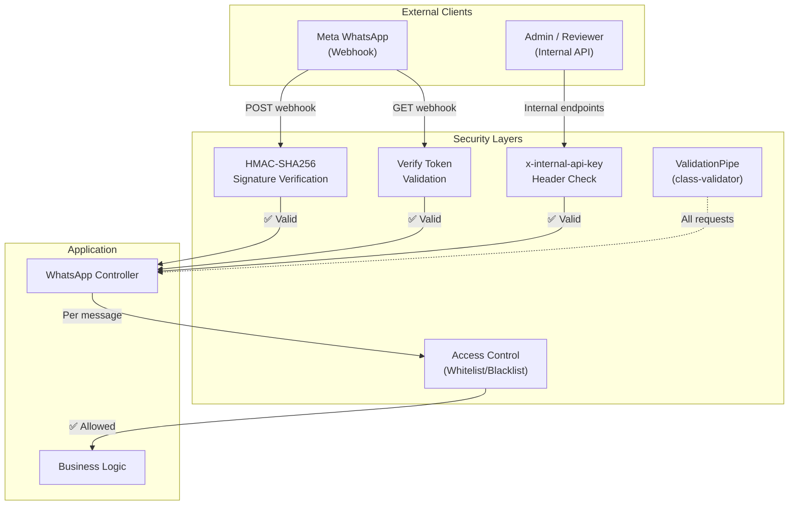
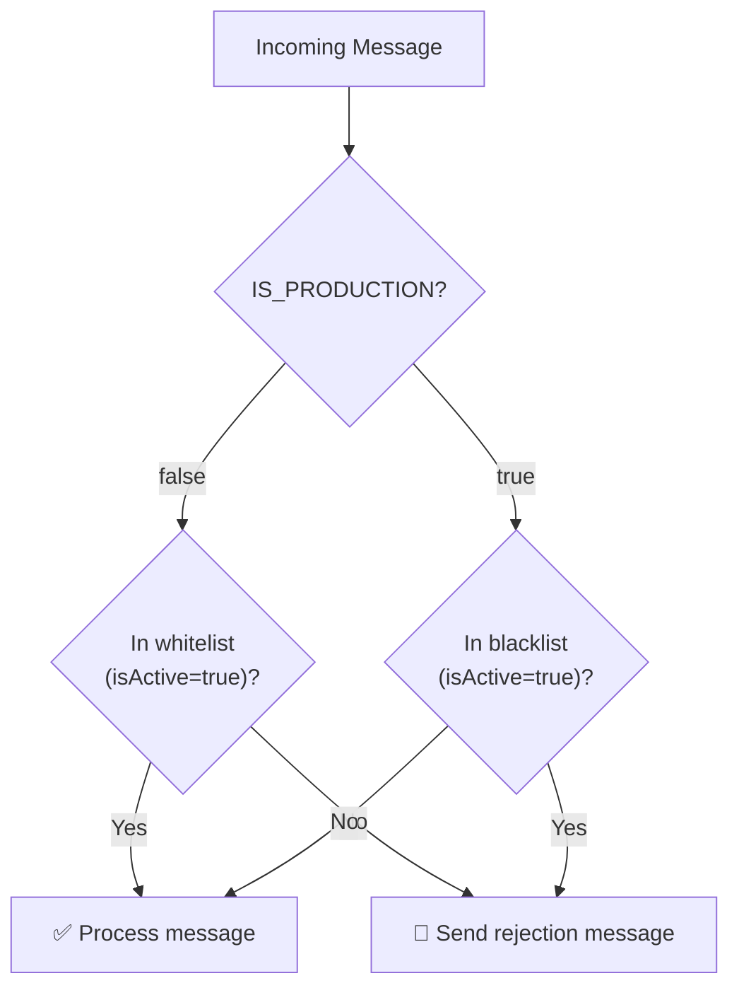
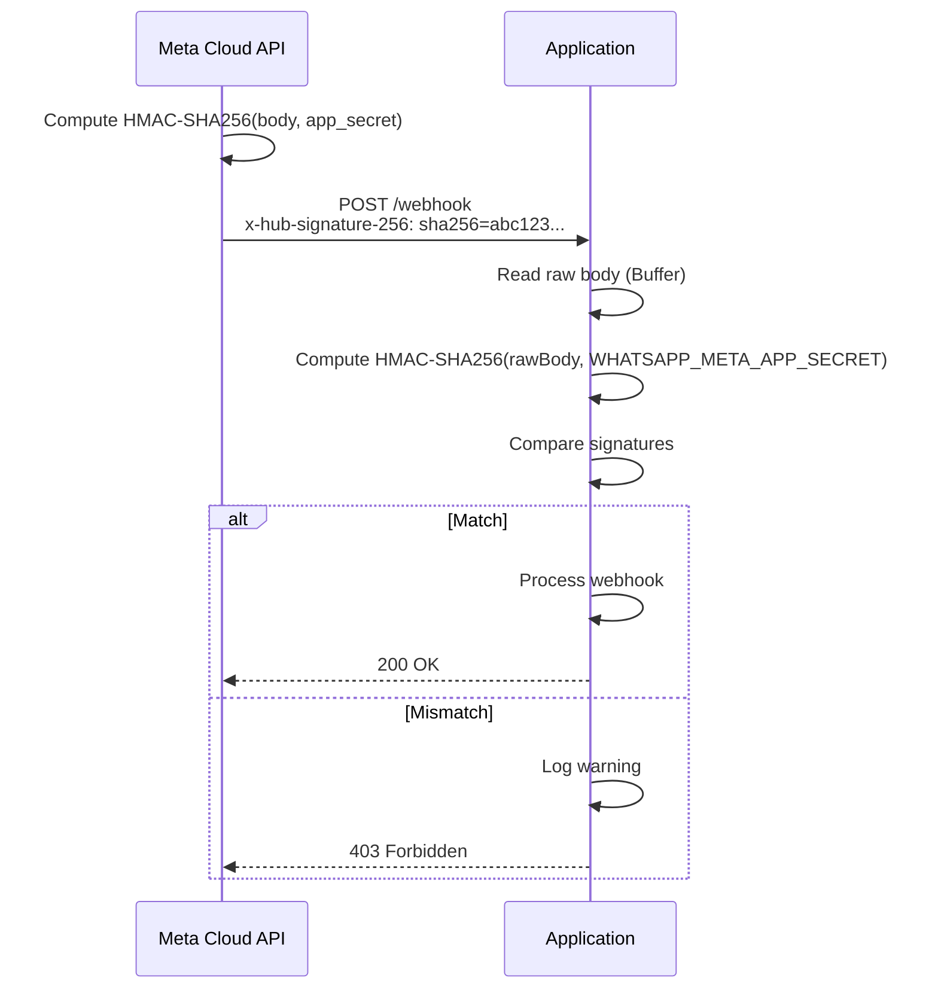

# Security Documentation

> Authentication mechanisms, authorization model, secrets management, and security best practices for the AjraSakha WhatsApp AI Assistant.

---

## Table of Contents

- [Security Architecture](#security-architecture)
- [Authentication Mechanisms](#authentication-mechanisms)
- [Authorization Model](#authorization-model)
- [Secrets Management](#secrets-management)
- [Webhook Security](#webhook-security)
- [Input Validation](#input-validation)
- [Error Handling & Information Disclosure](#error-handling--information-disclosure)
- [Network Security](#network-security)
- [Security Best Practices](#security-best-practices)
- [Known Security Considerations](#known-security-considerations)

---

## Security Architecture



---

## Authentication Mechanisms

### 1. Webhook Signature Verification (HMAC-SHA256)

**Applies to**: `POST /whatsapp/webhook`

Every inbound webhook from Meta includes an `x-hub-signature-256` header containing an HMAC-SHA256 digest of the raw request body, signed with the app secret.

```typescript
// Verification logic (whatsapp.controller.ts)
const expected = 'sha256=' +
  crypto.createHmac('sha256', appSecret)
    .update(rawBody)
    .digest('hex');

if (!signature || signature !== expected) {
  throw new ForbiddenException('Invalid signature');
}
```

**Key details**:
- Uses `rawBody` (Buffer) — not the parsed JSON body — to ensure byte-for-byte accuracy
- The app is bootstrapped with `rawBody: true` to capture the raw request body
- Constant-time comparison is **not** used (see [Known Security Considerations](#known-security-considerations))
- The secret is sourced from `WHATSAPP_META_APP_SECRET` environment variable

### 2. Webhook Verify Token

**Applies to**: `GET /whatsapp/webhook`

Meta sends a verification challenge during webhook subscription setup:

```typescript
if (mode === 'subscribe' && token === verifyToken) {
  return challenge; // Echo back the challenge
}
throw new ForbiddenException('Invalid verify token');
```

The verify token is sourced from `WHATSAPP_WEBHOOK_VERIFY_TOKEN` environment variable.

### 3. Internal API Key

**Applies to**: Internal admin endpoints

| Endpoint | Protected |
|---|---|
| `POST /whatsapp/send-message` | ✅ |
| `POST /whatsapp/reviewer-webhook` | ✅ |
| `GET /whatsapp/test-poll` | ✅ |
| `GET /whatsapp/users/count` | ✅ |
| `GET /whatsapp/users` | ✅ |

Authentication is performed via the `x-internal-api-key` header:

```typescript
private assertInternalApiKey(apiKey: string | undefined): void {
  const expectedKey = process.env.REVIEWER_INTERNAL_API_KEY;
  if (!expectedKey || apiKey !== expectedKey) {
    throw new ForbiddenException('Invalid API Key');
  }
}
```

**Security note**: If `REVIEWER_INTERNAL_API_KEY` is not set in the environment, **all internal endpoints reject all requests** (fail-closed behavior).

---

## Authorization Model

### Phone Number Access Control

The system implements a **dual-mode access control** based on the `IS_PRODUCTION` environment variable:

| Mode | `IS_PRODUCTION` | Behavior |
|---|---|---|
| **Development** | `false` (default) | **Whitelist only** — Only phone numbers in the `whitelist` collection are allowed |
| **Production** | `true` | **Blacklist only** — All phone numbers are allowed unless in the `blacklist` collection |



**Rejection message** (sent to unauthorized numbers):
> "Thank you for reaching out to ANNAM.AI. Your number is not currently whitelisted. For access, please contact Annam.ai Foundation at communications@annam.ai"

### Location Gate

Even after passing access control, users must share their location before the AI agent processes questions. Messages received before location is set trigger a location request prompt instead of AI processing.

---

## Secrets Management

### Secret Inventory

| Secret | Environment Variable | Exposure Risk | Rotation |
|---|---|---|---|
| MongoDB URI | `MONGO_URI` | Database access | Manual |
| WhatsApp Access Token | `WHATSAPP_ACCESS_TOKEN` | Send messages as bot | Via Meta Dashboard |
| WhatsApp App Secret | `WHATSAPP_META_APP_SECRET` | Forge webhooks | Via Meta Dashboard |
| Webhook Verify Token | `WHATSAPP_WEBHOOK_VERIFY_TOKEN` | Subscribe to webhooks | Manual |
| LLM API Key | `LLM_API_KEY` | LLM API costs, data access | Manual |
| Sarvam API Key | `SARVAM_API_KEY` | STT/TTS API costs | Manual |
| Gemini API Key | `GEMINI_API_KEY` | Gemini Live usage | Via Google Console |
| Internal API Key | `REVIEWER_INTERNAL_API_KEY` | Admin API access | Manual |
| Aegra Assistant ID | `AEGRA_ASSISTANT_ID` | Route to wrong agent | Manual |

### Development Secrets

- Stored in `.env` file (git-ignored via `.gitignore`)
- Loaded via `dotenv-cli` at startup
- Template provided in `.env.example` (no real values)

### Production Secrets

- Managed by **Infisical** (secrets management platform)
- Injected at container startup via `infisical run`
- No secrets baked into Docker images
- Authentication via Universal Auth (client ID + client secret)
- Secret path: `/annam-ajrasakha/WhatsApp`

### Git Protections

The `.gitignore` file excludes:
- `.env` — Environment secrets
- `config.yaml` — May contain internal URLs (only `config.example.yaml` is committed)

---

## Webhook Security

### Signature Verification Flow



### Important Implementation Details

1. **Raw body access**: NestJS is configured with `rawBody: true` in `NestFactory.create()`, and the controller uses `@RawBody()` to access the unmodified request bytes
2. **Early rejection**: Signature verification happens before any business logic processing
3. **Fail-closed**: If `WHATSAPP_META_APP_SECRET` is empty, the HMAC will never match a real signature, effectively blocking all webhooks

---

## Input Validation

### Global Validation Pipe

A global `ValidationPipe` is configured at application startup:

```typescript
app.useGlobalPipes(new ValidationPipe({
  whitelist: true,           // Strip unknown properties
  transform: true,           // Auto-transform payloads to DTO instances
  forbidNonWhitelisted: true, // Reject payloads with unknown properties
  disableErrorMessages: process.env.NODE_ENV === 'production', // Hide details in prod
}));
```

### Configuration Validation

The `config.yaml` file is validated at startup using `class-validator` against a comprehensive schema (`ConfigSchema`). Invalid configuration prevents the application from starting.

### Parameter Validation

Internal API endpoints validate query parameters manually:
- `isPaginated` — Must be exactly `"true"` or `"false"`
- `skip` — Must be a non-negative integer
- `limit` — Must be a positive integer (capped at 100)

---

## Error Handling & Information Disclosure

### Production Error Suppression

- `disableErrorMessages: true` in production — validation error details are not returned to clients
- Log-level filtering: Production uses `['error', 'warn', 'log']`, suppressing `debug` and `verbose`

### Error Logging

- Authentication failures (`invalid signature`, `invalid API key`) are logged at `warn` level
- Internal errors are logged at `error` level with stack traces
- Error messages in HTTP responses are generic in production

### Process Crash Handling

Global handlers prevent information leakage on crash:

```typescript
process.on('uncaughtException', (error) => {
  console.error('Uncaught Exception:', error);
  process.exit(1);
});

process.on('unhandledRejection', (reason, promise) => {
  console.error('Unhandled Rejection at:', promise, 'reason:', reason);
  process.exit(1);
});
```

Shutdown hooks are enabled for graceful cleanup: `app.enableShutdownHooks()`.

---

## Network Security

### Production Network Topology

- **Tailscale mesh VPN** secures CI/CD → production server communication
- No direct SSH access — Tailscale ACLs control who can reach the VM
- Application port (`3000`) is mapped to `9112` externally

### HTTPS/TLS

- **Meta → Application**: Meta requires HTTPS webhook URLs. TLS termination should be handled by a reverse proxy (nginx, Caddy) or cloud load balancer in front of the application.
- **Application → External APIs**: All outbound API calls use HTTPS (Meta Graph API, Sarvam, Anthropic, Gemini)
- **Application → Internal services**: MCP servers and LangGraph/Aegra communicate over HTTP within the private network (Tailscale mesh)

> **Requires clarification from the development team**: The reverse proxy / TLS termination configuration for production is not documented in this repository.

---

## Security Best Practices

### Implemented ✅

| Practice | Implementation |
|---|---|
| Webhook signature verification | HMAC-SHA256 on raw body |
| Secrets separation | `.env` for secrets, `config.yaml` for config |
| Secrets not in Docker images | Infisical runtime injection |
| Git-ignored secrets | `.gitignore` covers `.env` and `config.yaml` |
| Input validation | Global `ValidationPipe` with whitelisting |
| Fail-closed access control | Missing API key rejects all requests |
| Error message suppression | Disabled in production |
| Shutdown hooks | Graceful cleanup on termination |
| Dependency audit | Node.js 20 LTS base |

### Recommended Improvements ⚠️

| Improvement | Current State | Recommendation |
|---|---|---|
| **Constant-time comparison** | Uses `===` for signature comparison | Use `crypto.timingSafeEqual()` to prevent timing attacks |
| **Rate limiting** | Config present but `enabled: false` | Enable rate limiting for webhook and API endpoints |
| **CORS configuration** | Not configured | Add CORS restrictions if any browser clients exist |
| **Helmet.js** | Not installed | Add `@nestjs/helmet` for HTTP security headers |
| **Request logging** | Verbose in development | Add structured audit logging for security events |
| **API key rotation** | Manual process | Implement key rotation mechanism |
| **MongoDB auth** | Local dev uses no auth | Ensure production MongoDB requires authentication |
| **TLS for internal services** | HTTP between internal services | Consider mTLS for MCP/Aegra connections |

---

## Known Security Considerations

### 1. Timing Attack on Signature Verification

The webhook signature comparison uses JavaScript's `===` operator:

```typescript
if (!signature || signature !== expected) { ... }
```

This is vulnerable to timing attacks. While the practical risk is low (attacker would need many attempts with precise timing measurements), production systems should use:

```typescript
const signatureBuffer = Buffer.from(signature);
const expectedBuffer = Buffer.from(expected);
if (signatureBuffer.length !== expectedBuffer.length ||
    !crypto.timingSafeEqual(signatureBuffer, expectedBuffer)) { ... }
```

### 2. Internal API Key as Shared Secret

All internal endpoints share a single `REVIEWER_INTERNAL_API_KEY`. If compromised, an attacker could:
- Send messages as the bot to any user
- Access user analytics data
- Trigger polling operations

**Mitigation**: Consider per-endpoint or per-service API keys, or implement JWT-based authentication for internal services.

### 3. No Rate Limiting on Webhook

The webhook endpoint processes all valid requests without rate limiting. A compromised Meta app secret could be used for webhook flooding.

**Mitigation**: Enable the built-in rate limiting configuration or add a WAF/API gateway in front.

### 4. Phone Number as User Identifier

Phone numbers are used as the sole user identifier across all systems (MongoDB, LangGraph, reviewer desk). Phone number spoofing in the WhatsApp ecosystem is prevented by Meta's verification, but the design means:
- No user anonymization layer exists
- Phone numbers are logged extensively
- Phone numbers are stored in multiple systems (MongoDB, LangGraph, reviewer desk)

> **Requires clarification from the development team**: Data privacy compliance (GDPR, India's DPDP Act) for phone number storage and processing across multiple systems.
